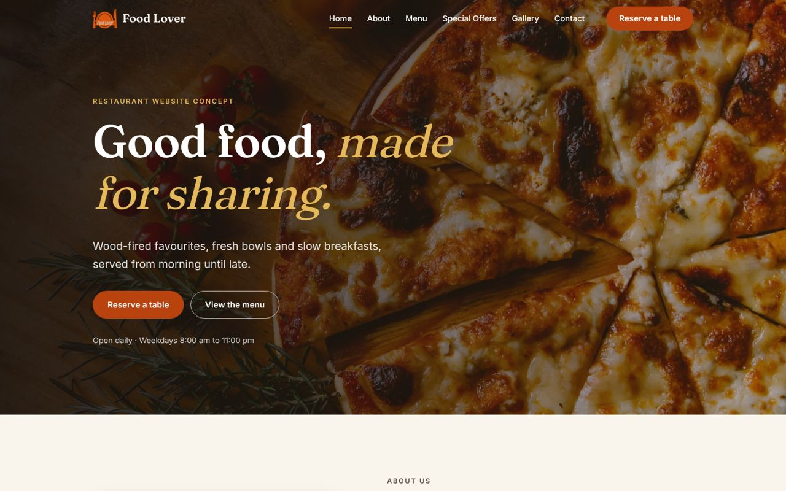
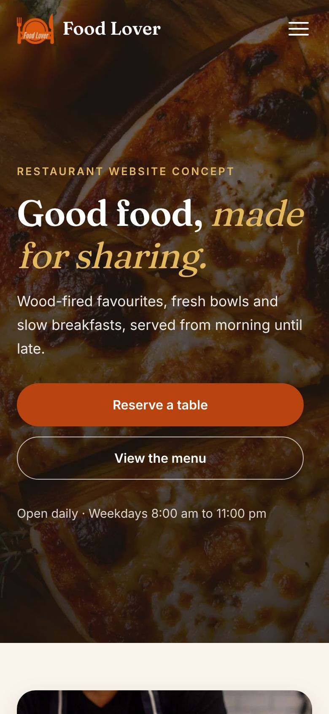
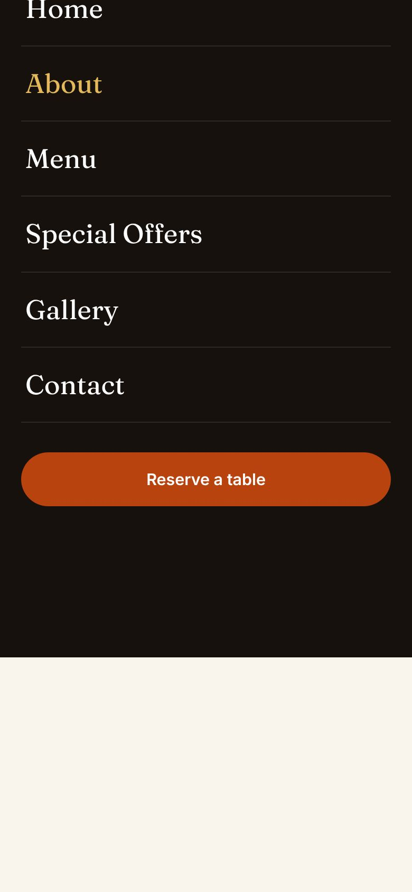
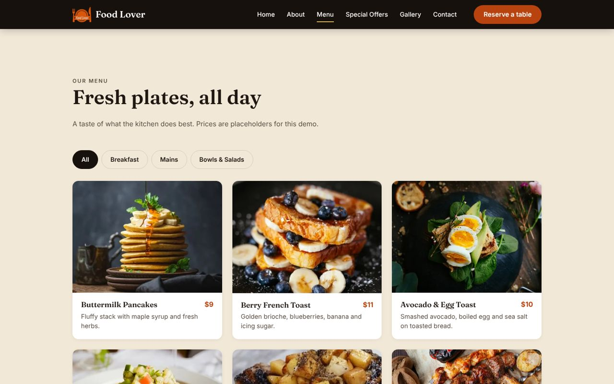

# Food Lover: Restaurant Website Concept

A responsive, single-page restaurant website built with plain HTML, CSS and JavaScript. It is a design and front-end portfolio project: the restaurant, menu, prices and contact details are fictional.

**Live demo:** https://mohammedszd.github.io/restaurant-site/



## Features

- Sticky header with a full-screen mobile menu (keyboard accessible, closes on Escape or link tap) and active-section highlighting
- Hero section with responsive imagery (separate mobile crop) and clear calls to action
- About section, special offers cards with clearly labelled demo prices
- Menu with client-side category filtering (All, Breakfast, Mains, Bowls & Salads)
- Photo gallery with an accessible lightbox built on the native `<dialog>` element (arrow keys, Escape, focus return)
- Contact details, opening hours and a demo reservation form that validates input but never sends or stores anything
- Subtle scroll-reveal animations that respect `prefers-reduced-motion`

## Technology

- HTML5, CSS3 (custom properties, grid, flexbox), vanilla JavaScript (no framework, no build step, no runtime dependencies)
- Self-hosted variable fonts: [Fraunces](https://github.com/undercasetype/Fraunces) and [Inter](https://github.com/rsms/inter) (SIL Open Font License, see `assets/fonts/`)
- Inline SVG icons and WebP images

## Screenshots

| Mobile | Mobile menu | Menu (desktop) |
| --- | --- | --- |
|  |  |  |

More in [`docs/screenshots/`](docs/screenshots/).

## Run locally

No installation is needed. Serve the folder with any static server:

```bash
git clone https://github.com/MohammedSZD/restaurant-site.git
cd restaurant-site
python3 -m http.server 8000
# open http://localhost:8000
```

All asset paths are relative, so the site works both at the domain root and under the GitHub Pages sub-path `/restaurant-site/`.

## Project structure

```
index.html            Page markup (single page, all sections)
favicon.ico
assets/
  css/style.css       Design tokens, base, components, sections
  js/main.js          Nav, scroll reveal, menu filter, lightbox, demo form
  fonts/              Self-hosted woff2 fonts and their licences
  img/                Optimised WebP images, logo, social preview image
docs/screenshots/     README screenshots
```

## Responsive design

The layout is mobile-first with deliberate changes per breakpoint rather than a scaled-down desktop page: a full-screen navigation panel below 960px, a horizontal list-style menu card on phones that becomes an image card grid on desktop, a separate hero crop for narrow screens and a 2-column to 3-column gallery. Layouts were checked in a headless browser at 320, 375, 430, 768, 1024, 1440 and 1920px with no horizontal overflow.

## Accessibility and performance

- Semantic landmarks, a logical heading order, a skip link and descriptive alt text
- Visible focus styles, 44px+ touch targets, labelled form fields, `aria-expanded` / `aria-pressed` / `aria-current` states
- Closed mobile navigation is removed from the tab order (`inert`)
- Reduced-motion support
- Width and height set on all images to avoid layout shift, lazy loading below the fold, WebP images (the page's images total roughly 1.9 MB including lightbox versions, down from about 25 MB of originals)
- Self-hosted fonts with `font-display: swap`; no third-party requests

## Known limitations

- The reservation form is a demonstration: nothing is submitted, stored or confirmed
- Menu, prices, offers, address, phone and email are placeholders
- Photos are taken from the original project; their original source and licence are not documented in the repository
- Single page only; no automated test suite

## Future improvements

- Add a real reservation or contact backend (or a mailto/third-party form) for a live business
- Provide AVIF variants and responsive `srcset` for the gallery
- Add a dark colour scheme
- Document photo sources and licences
